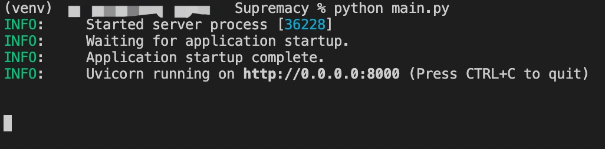
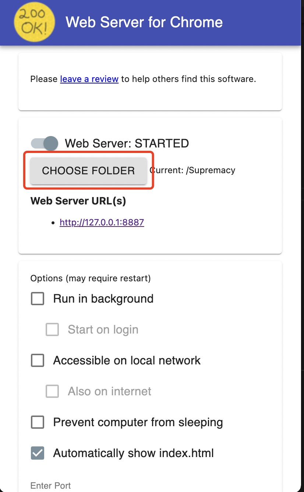

# Supremacy
---
## How to run
1. Start the back-end
   - pip install –r requirements.txt
   - python main.py

2. Use the apps named "web server for chrome" to run the system in the browser
   - select the directory of the project by the button called "CHOOSE FOLDER" in the following screenshot
